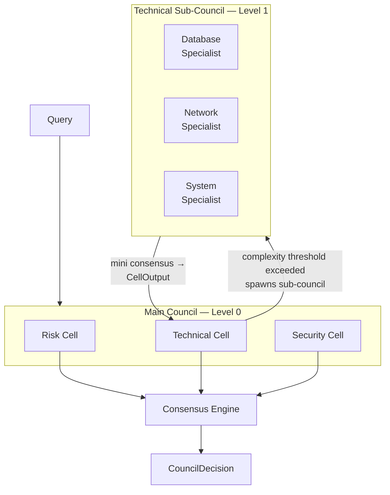
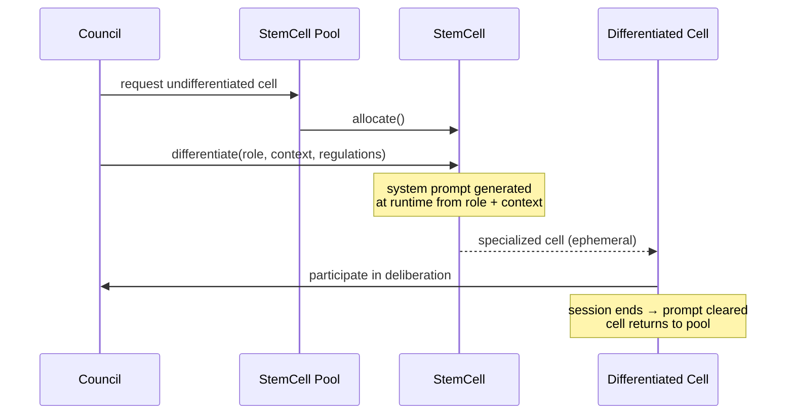
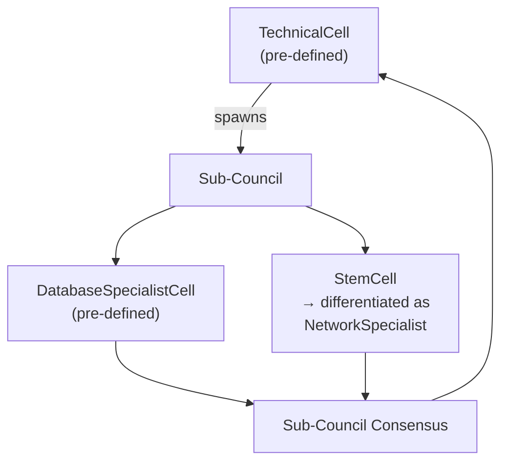

<div align="center">

# 🧬 Cellular Council Architecture

**A hierarchical multi-agent AI decision-making framework**  
*Inspired by biological cell specialization and corporate governance*

[](https://python.org)
[](LICENSE)
[](https://pypi.org/project/cellular-council/)
[](https://github.com/HakanKeskinoglu/cellular-council/actions)

[Documentation](https://cellular-council.readthedocs.io) · [Examples](examples/) · [Discord](#community)

</div>

---

## What is CCA?

Most AI systems respond to queries with a single model output. CCA challenges this by routing decisions through a **council of specialized AI agents** — each analyzing the problem from a different expert perspective — before synthesizing a consensus decision.

```
                    Query: "Should we escalate this database alarm?"
                           │
          ┌────────────────┼────────────────┐
          ▼                ▼                ▼
    ┌──────────┐    ┌──────────┐    ┌──────────┐
    │   Risk   │    │Technical │    │ Security │
    │   Cell   │    │  Cell    │    │  Cell    │
    │ "P(fail) │    │"Root:    │    │"Check    │
    │  = 0.87" │    │disk I/O" │    │ ACL logs"│
    └──────────┘    └──────────┘    └──────────┘
          │                │                │
          └────────────────┼────────────────┘
                           ▼
                  ┌─────────────────┐
                  │ Consensus Engine │
                  │  score: 0.84    │
                  └────────┬────────┘
                           ▼
               "ESCALATE — P1 incident.
                Disk failure imminent.
                Invoke runbook DB-007."
```

The framework draws from two domains:
- **Biology**: Cell specialization — same DNA, different gene expression, different function
- **Corporate governance**: Independent advisors and auditors who provide oversight without voting authority

---

## Key Features

- **🔬 Specialized Cells** — Risk, Ethics, Technical, Financial, Security, Legal, and custom roles
- **🗳️ Multiple Consensus Strategies** — Weighted average, majority vote, Delphi, unanimous, apex synthesis
- **🏭 Air-Gap Ready** — First-class Ollama integration for offline/data center deployment
- **💬 Structured Debate** — Cells review each other's analyses in multiple rounds before consensus
- **🛡️ Independent Advisors** — Non-voting oversight roles modeled on corporate governance
- **📊 Decision Traceability** — Every decision includes full reasoning chains, confidence scores, and dissenting views
- **⚡ Async-First** — Built on asyncio for concurrent cell execution
- **🧩 Plugin Architecture** — Drop in any LLM backend (Ollama, OpenAI, Anthropic, or custom)
- **🏥 Cell Health Monitoring** — Automatic degradation detection and recovery

---

## Installation

```bash
pip install cellular-council
```

With Ollama support (recommended for air-gapped environments):
```bash
pip install "cellular-council[ollama]"
```

With all backends:
```bash
pip install "cellular-council[all]"
```

---

## Quick Start

```python
import asyncio
from cca import Council, CellRole
from cca.core import ConsensusStrategy
from cca.llm.backends import OllamaBackend

async def main():
    # Configure the LLM backend
    # Ollama runs locally — perfect for air-gapped environments
    llm = OllamaBackend(model="llama3.2")

    # Create a council
    council = Council(
        name="SecurityCouncil",
        llm_backend=llm,
        strategy=ConsensusStrategy.WEIGHTED_AVERAGE,
        debate_rounds=1,  # 1 round of peer debate after initial analysis
    )

    # Add specialized cells
    council.add_cell(CellRole.RISK, weight=1.5)      # Risk gets extra weight
    council.add_cell(CellRole.TECHNICAL, weight=1.0)
    council.add_cell(CellRole.SECURITY, weight=1.2)

    # Deliberate
    decision = await council.deliberate(
        query="Should we deploy this hotfix to production at 3PM on a Friday?",
        context={
            "change_size": "12 files, 340 lines",
            "test_coverage": "87%",
            "last_incident": "2 weeks ago",
        }
    )

    print(f"Decision: {decision.decision}")
    print(f"Consensus: {decision.consensus_score:.0%}")
    print(f"Confidence: {decision.overall_confidence:.0%}")
    print(f"Risk Level: {decision.risk_level:.0%}")

    if decision.requires_human_review:
        print("⚠️  Low consensus — human review recommended")

    print("\nRationale:")
    print(decision.rationale)

asyncio.run(main())
```

---

## Consensus Strategies

| Strategy | Description | Best For |
|----------|-------------|----------|
| `WEIGHTED_AVERAGE` | Confidence-weighted aggregation | General purpose |
| `MAJORITY_VOTE` | Weighted voting on recommendation themes | Clear binary decisions |
| `APEX_OVERRIDE` | LLM synthesizes all outputs holistically | Complex nuanced decisions |
| `UNANIMOUS` | Requires near-complete agreement | High-stakes irreversible decisions |
| `DELPHI` | Multi-round with structured feedback | Research, policy decisions |

---

## Real-World Application: AlertMind

CCA ships with a reference implementation for **data center alarm management** — the first production use case that motivated the framework.

```python
from examples.alertmind.alarm_decision import create_alertmind_council, DataCenterAlarm

council = create_alertmind_council(ollama_model="llama3.2")

alarm = DataCenterAlarm(
    alarm_id="ALM-001",
    source="core-switch-01",
    severity="CRITICAL",
    category="NETWORK",
    message="BGP session DOWN — 847 prefixes withdrawn",
    affected_services=["api", "payments"],
    timestamp="2024-01-15T14:23:11Z",
)

decision = await council.deliberate(
    query=alarm.to_query(),
    context=alarm.to_context(),
)
# → "ESCALATE to P1. Network cell confirms BGP failure..."
```

Why AlertMind is the perfect first application:
- **Existing data**: Thousands of real alarms to validate against
- **Air-gapped**: Data centers cannot use cloud LLMs → Ollama is essential
- **High stakes**: Wrong decisions cost money and uptime
- **Traceable**: Operators need to understand *why* an alarm was escalated

---

## Architecture Deep Dive

```
┌─────────────────────────────────────────────────────────────┐
│                       Council                               │
│                                                             │
│  ┌────────┐  ┌────────┐  ┌────────┐  ┌────────┐            │
│  │  Stem  │  │  Risk  │  │ Ethics │  │  Tech  │  ← Cells   │
│  │  Cell  │→ │  Cell  │  │  Cell  │  │  Cell  │            │
│  │(diff.) │  │        │  │        │  │        │            │
│  └────────┘  └───┬────┘  └───┬────┘  └───┬────┘            │
│                  │           │           │                  │
│  ┌───────────────▼───────────▼───────────▼───────────────┐  │
│  │                  Synapse Layer                        │  │
│  │           (structured message passing)                │  │
│  └───────────────────────────┬───────────────────────────┘  │
│                              │                              │
│  ┌───────────────────────────▼───────────────────────────┐  │
│  │              Consensus Engine                         │  │
│  │   weighted_avg | vote | delphi | unanimous | apex     │  │
│  └───────────────────────────┬───────────────────────────┘  │
│                              │                              │
│  ┌─────────────┐             │  ┌─────────────────────────┐ │
│  │  Advisors   │─────────────┤  │    Apex Layer           │ │
│  │ (non-voting)│  advisory   │  │ (final synthesis)       │ │
│  └─────────────┘   notes     │  └─────────────────────────┘ │
│                              │                              │
│                    ┌─────────▼─────────┐                    │
│                    │  CouncilDecision  │                    │
│                    └───────────────────┘                    │
└─────────────────────────────────────────────────────────────┘
```

### Cell Specialization Model

```python
class RiskCell(BaseCell):
    @property
    def system_prompt(self) -> str:
        return """You are the RISK ANALYSIS CELL...
        Your exclusive focus: identify, quantify, and communicate RISK..."""
    
    async def analyze(self, query: str, context=None) -> CellOutput:
        # Role-specific analysis logic
        ...
```

The same LLM model behaves as a completely different expert depending on which cell's system prompt it receives — exactly like biological cell differentiation.

---

## Creating Custom Cells

```python
from cca.cells.base import BaseCell, CellRole
from cca.core import CellOutput

class ComplianceCell(BaseCell):
    def __init__(self, llm_backend, regulations=None, **kwargs):
        super().__init__(role=CellRole.LEGAL, llm_backend=llm_backend, **kwargs)
        self.regulations = regulations or ["GDPR", "SOC2", "ISO27001"]

    @property
    def system_prompt(self) -> str:
        regs = ", ".join(self.regulations)
        return f"""You are a COMPLIANCE SPECIALIST focused on {regs}.
        
        Analyze every decision for regulatory compliance implications...
        [OUTPUT FORMAT]"""

    async def analyze(self, query: str, context=None) -> CellOutput:
        prompt = f"COMPLIANCE REVIEW:\n\n{query}"
        return await self._call_llm(prompt, context=context)

# Add to council
compliance_cell = ComplianceCell(llm_backend=llm, regulations=["HIPAA", "GDPR"])
council.add_custom_cell(compliance_cell)
```

---


---

## Roadmap

- [x] Core cell architecture with BaseCell abstraction
- [x] Specialized built-in cells (Risk, Ethics, Technical, Financial, Security)
- [x] Consensus engine (weighted average, majority vote, apex override)
- [x] Multi-round debate mechanism
- [x] LLM backends: Ollama, OpenAI, Anthropic
- [x] AlertMind reference implementation
- [ ] Synapse visualization layer (WebSocket)
- [ ] Stem cell differentiation engine
- [ ] Cell health monitoring dashboard
- [ ] Flutter mobile app template
- [ ] Async streaming decisions
- [ ] PyPI publication
- [ ] Docker compose deployment

---

## Contributing

CCA is in early alpha — contributions are very welcome!

```bash
git clone https://github.com/HakanKeskinoglu/cellular-council
cd cellular-council
pip install -e ".[dev]"
pre-commit install
pytest
```

Please read [CONTRIBUTING.md](CONTRIBUTING.md) before submitting PRs.

---

## License

Apache License 2.0 — see [LICENSE](LICENSE) for details.

---

<div align="center">

Built with 🧬 by [Hakan](https://github.com/HakanKeskinoglu) | Inspired by biology, governed like a corporation

</div>


## Hierarchical Cell Architecture

CCA supports two mechanisms for dynamic, multi-level reasoning beyond a flat council of cells.

---

### Sub-Cell Spawning

A cell may determine that a query requires deeper specialization than it can provide alone. In this case, it opens an internal sub-council, runs a full deliberation at a lower level, and returns the result as its own `CellOutput` to the parent council. The parent council never sees the sub-council internals — it only receives a single, aggregated output.



**Implementation sketch:**

```python
class TechnicalCell(BaseCell):
    async def analyze(self, query: str, context=None) -> CellOutput:
        if self._requires_sub_council(query):
            sub = Council(
                name="TechnicalSubCouncil",
                llm_backend=self.llm_backend,
                strategy=ConsensusStrategy.MAJORITY_VOTE,
                debate_rounds=0,
                max_depth=self.depth + 1,   # depth guard
            )
            sub.add_cell(CellRole.DATABASE)
            sub.add_cell(CellRole.NETWORK)
            sub.add_cell(CellRole.SYSTEM)
            result = await sub.deliberate(query, context)
            return CellOutput.from_decision(result, source=self.role)
        return await self._call_llm(query, context)
```

**Design decisions:**
- `max_depth` is a required parameter — unchecked recursion is a real failure mode.
- Sub-council strategy does not need to match the parent's strategy.
- Recommended depth for production: **≤ 2 levels**. AlertMind target: 2 levels (main council → domain specialist council).

---

### Stem Cell Differentiation

A `StemCell` has no fixed role. The council assigns it a specialization at runtime by generating a system prompt on the fly. This mirrors biological cell differentiation — the same base model, different gene expression.



**Implementation sketch:**

```python
class StemCell(BaseCell):
    async def differentiate(
        self,
        role: str,
        context: dict | None = None,
        regulations: list[str] | None = None,
    ) -> "StemCell":
        self._dynamic_role = role
        self._system_prompt = await self._generate_system_prompt(
            role=role,
            context=context,
            regulations=regulations,
        )
        return self

    async def _generate_system_prompt(self, role, context, regulations) -> str:
        # A meta-LLM call that writes the specialist prompt
        # This is the only call with elevated trust requirements
        ...

    async def analyze(self, query: str, context=None) -> CellOutput:
        if not self._system_prompt:
            raise RuntimeError("StemCell must be differentiated before use")
        return await self._call_llm(query, context)
```

**Open design questions:**

| Question | Options | AlertMind recommendation |
|----------|---------|--------------------------|
| Who triggers differentiation? | Rule-based · LLM meta-reasoning · Council coordinator | Rule-based for now — deterministic and testable |
| Who writes the system prompt? | Template fill · Meta-LLM call | Template fill — avoids a second LLM trust surface |
| When is the cell recycled? | After session · After N uses · Never | After session — clean state guarantees |
| Depth applies? | Yes — stem cells can spawn sub-councils too | Cap at 1 for stem-originated sub-councils |

---

### Interaction Between the Two Mechanisms

Sub-cell spawning and stem cell differentiation are orthogonal and composable. A `StemCell` can be differentiated into a specialist and then spawn its own sub-council. A pre-defined `TechnicalCell` can spawn a sub-council containing `StemCell` instances differentiated on demand.



**Current status:** Sub-cell spawning is architecturally supported by the existing `Council` abstraction and requires no new primitives — only the spawning logic inside `BaseCell`. `StemCell` is a stub and is scheduled for implementation in Paper 4 (Template-Based Multi-Agent Systems).

For AlertMind, the recommended path is:
1. Implement sub-cell spawning with fixed specialist roles (`NetworkAlarmCell`, `HardwareAlarmCell`).
2. Validate on real alarm data before introducing dynamic stem cell differentiation.